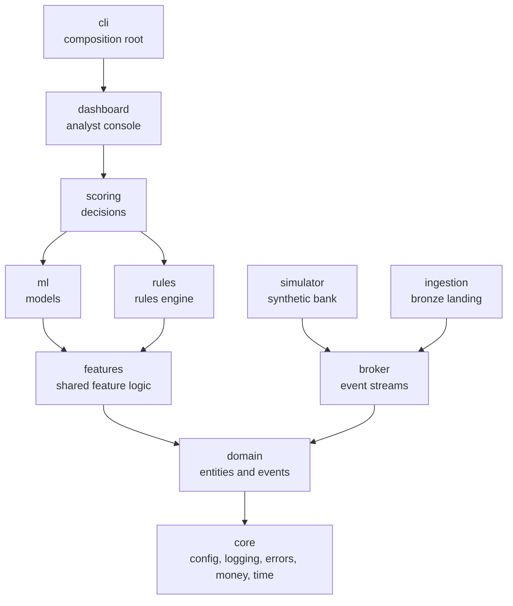

# Architecture

Sentinel ZA is one Python package (`sentinel`) organised **by feature**, with a strict
**layered** dependency rule. The rules below are enforced automatically in CI by
[import-linter](https://import-linter.readthedocs.io/) (`uv run poe arch`), so they cannot
silently erode.

## Layers

Arrows point from a package to the packages it may import. Imports only flow **downwards**.

| Layer | Responsibility | May import |
|---|---|---|
| `cli` | Parses commands and wires concrete implementations together | Everything |
| `dashboard` | Analyst console | `scoring` and below |
| `scoring` | Combines rules and models into approve / review / block | `ml`, `rules` and below |
| `ml`, `rules` | Models; YAML rules. Independent of each other | `features` and below |
| `features` | Feature logic shared by training and live scoring | `domain`, `core` |
| `simulator`, `ingestion` | Produce events; land events in bronze. Independent of each other | `broker` and below |
| `broker` | Event broker interface and implementations | `domain`, `core` |
| `domain` | Entities and events; pure data, no I/O | `core` |
| `core` | Config, logging, errors, money, time | Nothing in `sentinel` |

Two contracts are enforced:

1. **Layered architecture.** A lower layer never imports a higher one, and the pairs marked
   independent (`ml` / `rules`, `simulator` / `ingestion`) never import each other.
2. **Pure foundations.** `domain` and `core` never import I/O frameworks (Typer, SQLite,
   DuckDB, SQLAlchemy, Kafka, Streamlit), so business logic is testable without them.

## Design rules

**Depend on interfaces, not implementations.** Where a component talks to the outside
world (broker, databases, files), its package defines a `typing.Protocol` describing what
it needs, and concrete classes implement it. Code receives implementations as arguments
(dependency injection); only `cli` chooses which implementation to use. This is why the
local SQLite event log can be swapped for Kafka, or SQLite for Postgres, without touching
business logic.

**Each package has a small public surface.** Modules whose names start with `_` are
internal to their package. Other packages import only public modules.

**Validate at the boundaries.** Data entering the system (events, files, configuration) is
validated with Pydantic models once, at the edge. Code inside can then trust its inputs.

**One source of truth per concern.** Settings come only from `sentinel.core.config`,
money conversions only from `sentinel.core.money`, timestamps only from
`sentinel.core.datetimes`. Never re-implement these locally.

## Related documents

- [Data model](data-model.md)
- [Architecture decision records](adr/README.md)
- [Contributing guide](../CONTRIBUTING.md)
