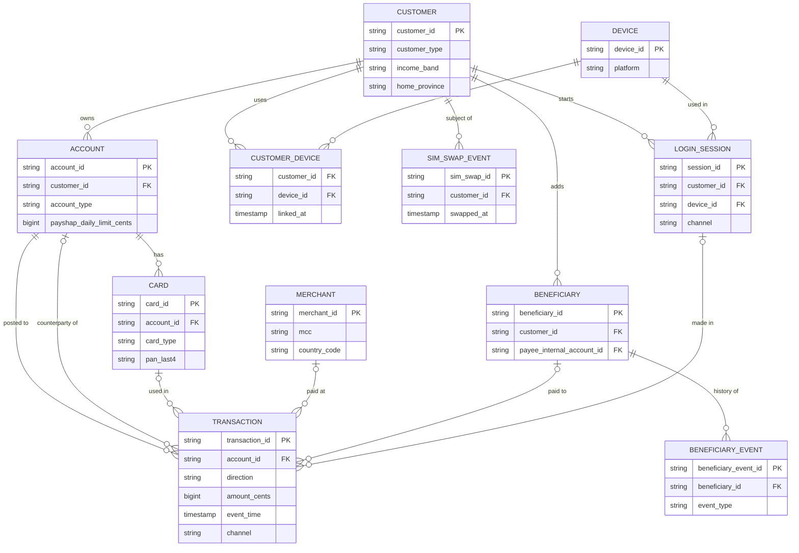
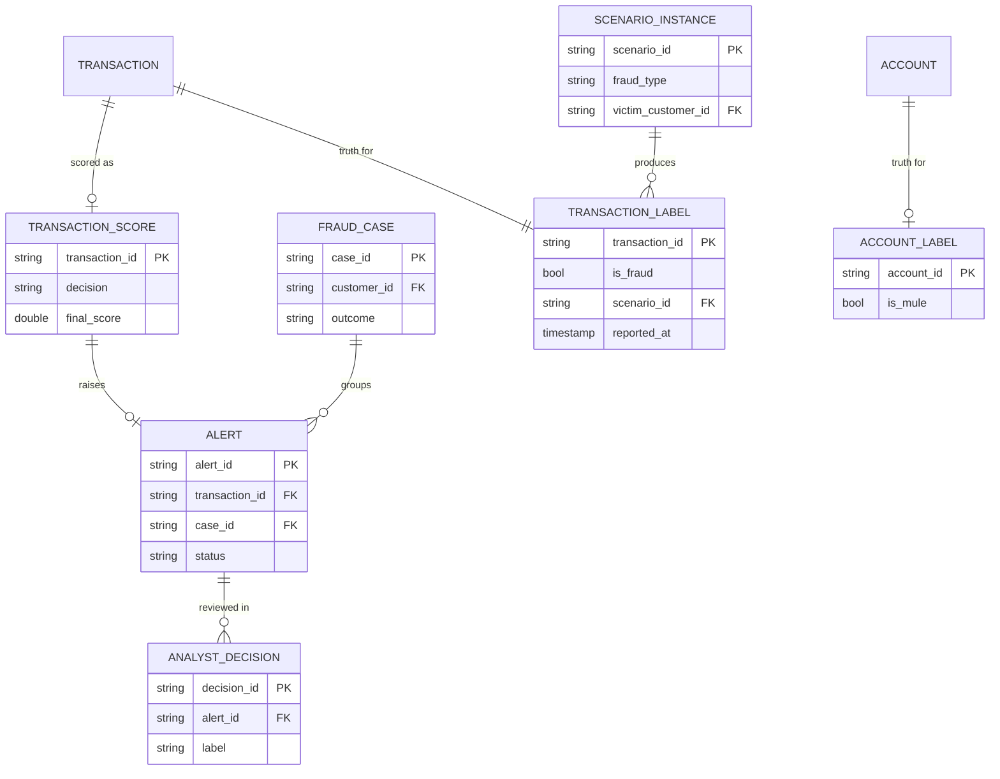

# Data Model

This document defines every entity Sentinel ZA generates, streams, stores and scores.
It is the contract between the simulator, the pipeline, the models and the analyst console.

## Design principles

| Principle | Why |
|---|---|
| **Ground truth is separate from observable data** | Fraud labels live in their own `truth` tables. The scoring service never reads them, so models cannot "cheat" (label leakage). |
| **Money is stored as integer cents** (`amount_cents`) | Floating-point maths loses cents (`0.1 + 0.2 != 0.3`). Banks use integer minor units. |
| **All timestamps are UTC** | South Africa is UTC+2 with no daylight saving, so conversion for reporting is trivial and unambiguous. |
| **Event time vs processing time** | Every event carries `event_time` (when it happened). Bronze adds `_ingested_at` (when we received it). Late events are detected from the gap. |
| **Double-entry for transfers** | An internal transfer creates two rows (debit and credit) sharing a `transfer_group_id`. Balances stay correct and the money-flow graph for mule detection falls out naturally. |
| **Deterministic IDs** | IDs are prefixed sequences generated from the simulation seed (`CUS-0000042`), so the same seed always produces the same data. |
| **Synthetic PII, masked in silver** | Names, ID numbers, phone and account numbers are fake but realistic. They appear in bronze, and are hashed or masked from silver onwards (POPIA practice). |
| **Raw events, not derived features** | Source tables hold only what a real system would record. Features such as "is new device" are computed in the shared feature module, never stored at source. |

## Entity-relationship diagram (observable data)

## Entity-relationship diagram (scoring, cases and ground truth)

## How data flows through the layers

| Layer | Storage | Contents |
|---|---|---|
| **Source** | Simulator output | Reference data (batch) and event streams (via the broker) |
| **Bronze** | Parquet, append-only, partitioned by event date | Events exactly as received, plus ingestion metadata |
| **Silver** | DuckDB | Typed, deduplicated, validated, PII-masked |
| **Gold** | DuckDB | Star schema and marts for analytics, training and dashboards |
| **Operational** | SQLite (Postgres in CI) | Scores, alerts, cases, analyst decisions (written by live services) |
| **Truth** | Parquet, separate folder | Simulator ground truth: for training labels and evaluation only |

**Reference data (batch, written once per simulation):** `customer`, `account`, `card`, `device`, `customer_device`, `merchant`.

**Event streams (through the broker):**

| Topic | Entity |
|---|---|
| `transactions.raw` | `transaction` |
| `logins.raw` | `login_session` |
| `sim_swaps.raw` | `sim_swap_event` |
| `beneficiaries.raw` | `beneficiary_event` |

## Data dictionary

Types are logical: `string`, `int`, `bigint`, `double`, `bool`, `date`, `timestamp` (UTC), `json`.
**PII** marks columns that are masked or hashed from silver onwards.

### customer

One row per bank customer (individual or business).

| Column | Type | PII | Description |
|---|---|---|---|
| customer_id | string | | PK. `CUS-0000001` |
| customer_type | string | | `individual` or `business` |
| full_name | string | yes | Person or registered business name |
| sa_id_number | string | yes | Synthetic 13-digit SA ID number with valid checksum (individuals only) |
| company_reg_number | string | yes | Synthetic CIPC-style registration number (businesses only) |
| date_of_birth | date | yes | Individuals only |
| phone_number | string | yes | `+27…`; also the customer's PayShap ShapID |
| email | string | yes | |
| income_band | string | | `low`, `middle`, `high`, `business`. Drives spending behaviour |
| income_source | string | | `salary`, `grant`, `business`, `mixed`. Drives payday timing |
| pay_day | int | | Day of month income usually arrives (e.g. 25; grants early in the month) |
| home_province | string | | One of the 9 provinces |
| home_city | string | | |
| home_lat, home_lon | double | | Home location (for travel-distance features) |
| preferred_channel | string | | `app`, `internet`, `ussd` |
| onboarded_at | timestamp | | Date the customer joined the bank |

### account

| Column | Type | PII | Description |
|---|---|---|---|
| account_id | string | | PK. `ACC-0000001` |
| customer_id | string | | FK → customer |
| account_number | string | yes | Synthetic 10–11 digit account number |
| account_type | string | | `cheque`, `savings`, `credit_card`, `business_current` |
| opened_at | timestamp | | Recently opened accounts matter for mule detection |
| status | string | | `active`, `dormant`, `frozen`, `closed` |
| opening_balance_cents | bigint | | Balance at simulation start |
| credit_limit_cents | bigint | | Credit-card accounts only |
| daily_transfer_limit_cents | bigint | | EFT / app transfer limit |
| payshap_daily_limit_cents | bigint | | Default `5000000` (R50,000) |

### card

Full card numbers are never stored (PCI DSS practice): only a token and the last 4 digits.

| Column | Type | PII | Description |
|---|---|---|---|
| card_id | string | | PK. `CRD-0000001` |
| account_id | string | | FK → account |
| card_type | string | | `debit` or `credit` |
| pan_token | string | | Random token standing in for the card number |
| pan_last4 | string | | Last 4 digits shown to analysts |
| issued_at | timestamp | | |
| expires_on | date | | |
| status | string | | `active`, `blocked`, `reported_lost` |
| daily_atm_limit_cents | bigint | | |
| daily_pos_limit_cents | bigint | | |

### device

A device can be linked to more than one customer. A single fraudster device linked to many victims is a strong signal.

| Column | Type | PII | Description |
|---|---|---|---|
| device_id | string | | PK. `DEV-0000001` |
| device_fingerprint | string | | Hash representing the device |
| platform | string | | `android`, `ios`, `web`, `feature_phone` |
| first_seen_at | timestamp | | |

### customer_device

| Column | Type | PII | Description |
|---|---|---|---|
| customer_id | string | | PK part, FK → customer |
| device_id | string | | PK part, FK → device |
| linked_at | timestamp | | When the device was registered to the profile |
| link_method | string | | `app_registration`, `otp`, `branch` |

### sim_swap_event

| Column | Type | PII | Description |
|---|---|---|---|
| sim_swap_id | string | | PK. `SIM-0000001` |
| customer_id | string | | FK → customer |
| phone_number | string | yes | Number that was swapped |
| swapped_at | timestamp | | When the network performed the swap (event time) |
| notified_at | timestamp | | When the bank was notified (can lag by hours) |
| network | string | | Fictional mobile network (`MNO-1` … `MNO-4`) |

### login_session

| Column | Type | PII | Description |
|---|---|---|---|
| session_id | string | | PK. `SES-0000001` |
| customer_id | string | | FK → customer |
| device_id | string | | FK → device (null for USSD) |
| channel | string | | `app`, `internet`, `ussd` |
| started_at | timestamp | | Event time |
| auth_method | string | | `password`, `biometric`, `otp`, `pin` |
| ip_country | string | | ISO country code (null for USSD) |
| lat, lon | double | | Approximate location (nullable) |
| remote_access_detected | bool | | App detected screen-sharing software running |

### merchant

ATMs are modelled as merchants with MCC `6011` so all card activity has one shape.

| Column | Type | PII | Description |
|---|---|---|---|
| merchant_id | string | | PK. `MER-0000001` |
| merchant_name | string | | Fictional name |
| mcc | string | | 4-digit merchant category code |
| category | string | | Readable category (see below) |
| country_code | string | | ISO 3166 alpha-2; non-`ZA` for foreign merchants |
| city | string | | Null for online merchants |
| lat, lon | double | | Null for online merchants |
| is_online | bool | | Card-not-present merchant |

Categories used (MCC): grocery `5411`, fuel `5541`, toll `4784`, ATM `6011`, restaurant `5812`,
clothing `5651`, online retail `5999`, digital goods `5815–5818`, software `5734`,
advertising `7311`, travel agency `4722`, betting `7995`, crypto / quasi-cash `6051`, airtime `4814`.

### beneficiary

Current state of each saved payee. Full history is in `beneficiary_event`.

| Column | Type | PII | Description |
|---|---|---|---|
| beneficiary_id | string | | PK. `BEN-0000001` |
| customer_id | string | | FK → customer who saved the payee |
| beneficiary_name | string | yes | Name the customer gave the payee |
| payee_bank | string | | Fictional bank name |
| payee_account_number | string | yes | |
| payee_internal_account_id | string | | FK → account when the payee banks with us (enables the money-flow graph) |
| shap_id | string | yes | Phone proxy for PayShap payees (nullable) |
| created_at | timestamp | | |

### beneficiary_event

Captures supplier-mandate fraud: a payee's bank details change, then a large payment follows.

| Column | Type | PII | Description |
|---|---|---|---|
| beneficiary_event_id | string | | PK. `BEV-0000001` |
| beneficiary_id | string | | FK → beneficiary |
| event_type | string | | `created`, `details_changed`, `deleted` |
| event_time | timestamp | | |
| session_id | string | | FK → login_session that made the change |
| old_account_number | string | yes | Null when created |
| new_account_number | string | yes | Null when deleted |

### transaction

The core event. One row per entry posted to an account. Internal transfers produce two rows (debit and credit) with the same `transfer_group_id`.

| Column | Type | PII | Description |
|---|---|---|---|
| transaction_id | string | | PK. `TXN-000000001` |
| transfer_group_id | string | | Links both legs of an internal transfer (nullable) |
| account_id | string | | FK → account the entry is posted to |
| direction | string | | `debit` (money out) or `credit` (money in) |
| amount_cents | bigint | | Always positive, in ZAR cents |
| original_amount_cents | bigint | | Amount in original currency for foreign card transactions |
| original_currency | string | | ISO 4217, e.g. `USD` (nullable) |
| event_time | timestamp | | When the transaction happened (UTC) |
| channel | string | | `card_present`, `card_not_present`, `atm`, `eft`, `payshap`, `internal_transfer`, `salary_credit`, `debit_order` |
| card_id | string | | FK → card (card channels only) |
| merchant_id | string | | FK → merchant (card channels only) |
| beneficiary_id | string | | FK → beneficiary (outgoing payments) |
| counterparty_account_id | string | | FK → account when the other side banks with us |
| counterparty_external_ref | string | | Opaque reference for external counterparties (employers, other banks) |
| session_id | string | | FK → login_session (digital channels) |
| device_id | string | | FK → device (digital channels) |
| entry_mode | string | | `chip`, `contactless`, `magstripe`, `ecommerce`, `manual` (card channels) |
| auth_method | string | | `pin`, `otp`, `3ds`, `biometric`, `none` |
| terminal_lat, terminal_lon | double | | Card-present location (nullable) |
| country_code | string | | Where the transaction happened |
| status | string | | `approved` or `declined` |
| decline_reason | string | | e.g. `insufficient_funds`, `limit_exceeded` (nullable) |
| balance_after_cents | bigint | | Account balance after posting |
| schema_version | int | | Event schema version, starts at `1` |

### Bronze ingestion metadata

Added to every bronze row by the ingestion consumer.

| Column | Type | Description |
|---|---|---|
| _ingested_at | timestamp | When the event was received |
| _source_topic | string | Broker topic |
| _source_offset | bigint | Offset in the topic (supports exactly-once replays) |
| _batch_id | string | Micro-batch that wrote the row |

### Operational tables (written by live services)

**transaction_score** (one per scored transaction)

| Column | Type | Description |
|---|---|---|
| transaction_id | string | PK, FK → transaction |
| scored_at | timestamp | |
| model_version | string | Model used, from MLflow |
| rules_score | double | 0–1 |
| ml_score | double | 0–1 |
| final_score | double | Combined score, 0–1 |
| decision | string | `approve`, `review`, `block` |
| reason_codes | json | Top reasons, e.g. `["NEW_BENEFICIARY", "AMOUNT_12X_NORMAL"]` |
| latency_ms | double | Time taken to score |

**alert**

| Column | Type | Description |
|---|---|---|
| alert_id | string | PK. `ALR-0000001` |
| transaction_id | string | FK → transaction |
| customer_id | string | FK → customer |
| case_id | string | FK → fraud_case (nullable until grouped) |
| created_at | timestamp | |
| priority | int | 1 (highest) to 3 |
| status | string | `open`, `in_review`, `closed` |

**fraud_case** (groups related alerts for one customer)

| Column | Type | Description |
|---|---|---|
| case_id | string | PK. `CAS-0000001` |
| customer_id | string | FK → customer |
| opened_at | timestamp | |
| closed_at | timestamp | Nullable |
| status | string | `open`, `closed` |
| outcome | string | `confirmed_fraud`, `legitimate`, `inconclusive` (nullable) |

**analyst_decision** (feeds the retraining loop)

| Column | Type | Description |
|---|---|---|
| decision_id | string | PK. `DEC-0000001` |
| alert_id | string | FK → alert |
| analyst_id | string | Who decided |
| decided_at | timestamp | |
| label | string | `fraud` or `legitimate` |
| notes | string | Free text |

### Ground truth (simulator only; never read by the scoring service)

**scenario_instance** (one per injected fraud episode)

| Column | Type | Description |
|---|---|---|
| scenario_id | string | PK. `SCN-0000001` |
| fraud_type | string | `sim_swap_takeover`, `card_not_present`, `card_present_lost_stolen`, `card_present_counterfeit`, `app_vishing`, `app_remote_access`, `supplier_mandate`, `payshap_drain`, `mule_layering` |
| victim_customer_id | string | FK → customer (null for pure mule activity) |
| started_at | timestamp | |
| ended_at | timestamp | |
| total_amount_cents | bigint | Total stolen in this episode |
| params | json | Parameters used, for reproducibility |

**transaction_label**

| Column | Type | Description |
|---|---|---|
| transaction_id | string | PK, FK → transaction |
| is_fraud | bool | |
| fraud_type | string | Nullable |
| scenario_id | string | FK → scenario_instance (nullable) |
| reported_at | timestamp | When the bank would learn it was fraud (claim or chargeback). Models may only use labels available at training time |

**account_label**

| Column | Type | Description |
|---|---|---|
| account_id | string | PK, FK → account |
| is_mule | bool | |
| mule_since | timestamp | Nullable |

## Gold layer (star schema)

| Table | Grain | Notes |
|---|---|---|
| `fct_transaction` | One posted entry | Joins to all dimensions; amounts in cents and rand |
| `fct_alert` | One alert | Alert lifecycle and analyst outcome |
| `dim_customer` | One customer | PII masked |
| `dim_account` | One account | |
| `dim_merchant` | One merchant | |
| `dim_device` | One device | |
| `dim_beneficiary` | One version of a beneficiary | **SCD Type 2**: a new row each time bank details change |
| `dim_date` | One calendar day | Includes month-start (grant days) and month-end (payday) flags |
| `mart_daily_fraud_by_type` | Day × fraud type | Counts and rand values |
| `mart_customer_risk_profile` | One customer | Rolling behaviour summary |
| `mart_alert_outcomes` | Day | Alerts, true and false positives, rand saved |

## PII handling in silver

| Column | Treatment |
|---|---|
| full_name, beneficiary_name | Replaced with a salted SHA-256 hash; initials kept for display |
| sa_id_number, company_reg_number | Salted SHA-256 hash |
| date_of_birth | Converted to age band |
| phone_number, shap_id | Masked to `+27*****1234` |
| email | Domain kept, local part hashed |
| account_number, payee_account_number | Last 4 digits only |

## Default simulation size

Sized for an 8 GB laptop. All values are configurable.

| Setting | Development | Full run |
|---|---|---|
| Customers | 2,000 | 10,000 |
| Simulated period | 3 months | 6 months |
| Transactions (approx.) | 250,000 | 2,500,000 |
| Fraud rate (by transaction) | about 0.2% | about 0.2% |
| Mule accounts | 1–3% of accounts | 1–3% of accounts |
| Bronze size on disk (approx.) | 15 MB | 150 MB |
